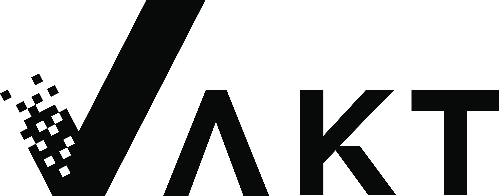
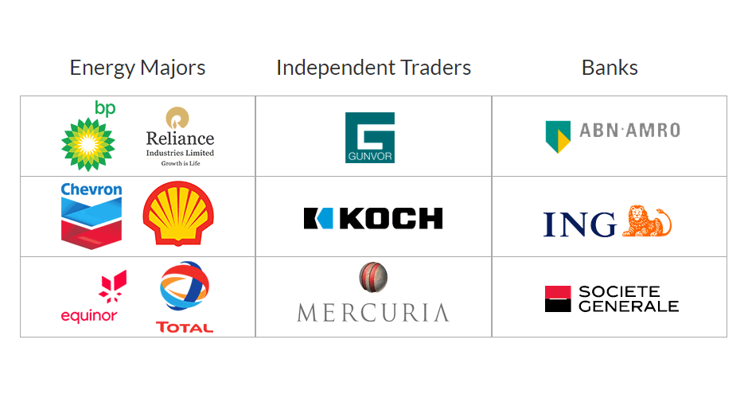
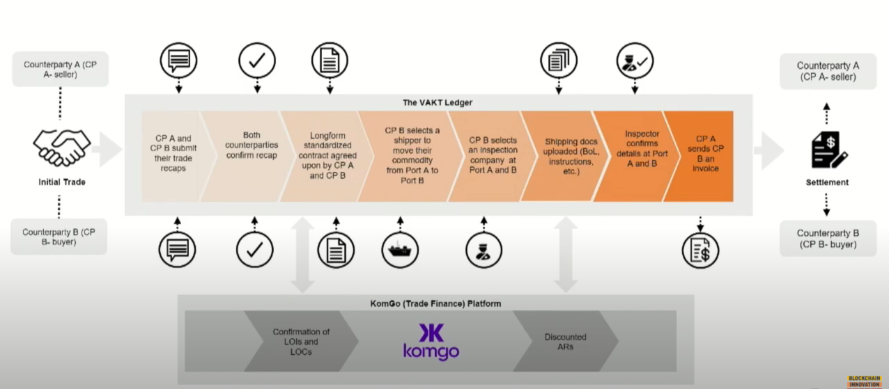

# **Case Study: VAKT Global & Blockchain Technology in the Physical Commodities Market**
## **Origin and Overview**

Beginning in the 1990s and gaining substantial momentum around 2000, the rapid expansion and industrialization of the world's large emerging markets resulted in a surge in demand for the physical commodities such industrialization requires (i.e. energy, metals, etc.) and affords (rice, wheat, etc.). The effects of this demand surge are reflected in the changes in the price of virtually every commodity during that time period (real energy prices, for instance, increased by 154% from 2000-2008, 67% of which growth is attributable to seven largest emerging markets). In short, the physical commodities market was not only in a supercycle of growth but in fact the landscape of its major players was itself evolving and globalizing [1].

Although commodity prices eventually subsided in 2012 (in parallel with the rate of growth in the emerging markets), the logistical complexities of physical commodity trading, in part a byproduct of both the market's sheer size and its newfound international breadth and heterogeneity, were built in. Relative to the transformations the commodities market had undergone over the preceding two decades, the processes through which players in the market participated lagged severely. Unequipped to securely and efficiently facilitate the interaction of relevant parties in the unprecedentedly globalized and interconnected commodities market, traditional methods of trade placement, financing, and settlement led to high operational costs and losses to friction [2].

By mid-2017, interest in exploring the potential of blockchain-based solutions to inefficiencies in business operations had proliferated through countless corporations across a multitude of sectors. A group of nine such corporations comprising several of the world’s largest players in the energy, commodity trading, and banking industries collaborated to found a company tasked with building, implementing, and overseeing the adoption of a crude oil trading platform to supplant the traditional trading process, which had become unsustainable. 

VAKT Global Ltd. was officially incorporated on June 28, 2018 [3], having been funded in earlier that year with $8.9 million in seed capital from its founding shareholders -- energy sector institutions British Petroleum, Shell, and Equinor, trading firms Gunvor, Mercuria, and Koch Supply & Trading, and European banking players ABN AMRO, ING, and Société Générale -- with an additional $9.1 million in funding coming in August of that year [4]. In December, energy giants Chevron, Total SE, and Reliance Industries bought into the VAKT consortium and were followed a year later by Saudi Aramco, after which funding for VAKT Global totaled $38.1 million [5] [6].

## **Business Activities**

### **Company Objectives**

The longterm goal of VAKT Global is to realize a complete overhaul of the physical commodities market's archaic, largely paper-based post-trade processes in favor of a blockchain-based transaction and settlement ecosystem. Although the company has stated that its "ambition is to extend the platform to all physically traded energy commodities" [7], at present, VAKT Global’s focus is on digitizing the process of enterprise-level crude oil trading exclusively. VAKT has developed its multisurface platform with the aim of effectuating dramatic improvements in not only the speed but also the security, accuracy, and transparency of enterprise-level commodity trading and financing. In theory, once such an infrastructure had been sufficiently widely adopted, the resultant reductions in frictional costs that currently impede commodities market transactions would enable the expansion of new trade financing opportunities [8] Critical to the actualization of this envisioned platform is the amelioration of three major issues that persist in the traditional mechanisms of the commodities market:   
 
 
1. _Security_

    In the past, a great portion of the information concerning a given transaction would be exchanged between counterparties over email or by physical mail, a system of correspondence which leaves the parties exposed to fraud and malicious third-party attacks. Because all information relevant to a transaction is committed to a secure platform, the necessity of email or physical mail correspondence is eliminated, by extension eliminating the risk posed by fraud and breaches [9]. Once information has been committed to the platform, it is encrypted and is only made available on a strict "need to know" basis (so strict, in fact, that VAKT itself does not have general access to the sensitive data of its customers) [10]. This eliminates the potential of a customer's data being sold by the company, as has happened with oil trading platforms in the past [11].

2.  _Trade Financing_ 

    Once a trade has been completed, traders will often require a third party to finance the transaction. Historically, labor-intensive risk assessment and transaction processing have rendered commodity trade finance an expensive component of the post-trade life cycle to secure. In addressing this, VAKT endeavors to offer surety to banks as to the execution of the transaction, thereby mitigating the risk-based cost of the process. Additionally, VAKT has partnered with komgo SA, a blockchain company which aims to streamline commodity trade finance by implementing a more secure and more efficient interface through which its network members may interact with finance-seeking traders. Once a transaction is completed on VAKT's blockchain, information relevant to its finance is transmitted to the blockchain of komgo, and according to CEO Etienne Amic, the traders usually are usually financed within a minutes. These factors collectively allow for lower finance premiums, faster settlements, and access to a greater number of potential financing options. [12] [13]

3. _Efficiency_

    Given the numerous parties involved in the post-trade life cycle, it is perhaps on the issue of efficiency that the relative advantages of a decentralized ledger are most apparent. In the absence of a platform like that which VAKT has built, each respective party involved in a trade would independently review and modify paperwork within their own storage systems. Such a process is redundant and immensely time-consuming if completed correctly by all parties, and it would only become even more time-consuming if one were to account for the possibility of errors made by any one entity in the sequence. Reconciliation of discrepencies in transaction information would be done manually, as would correspondance with each party (the terminals, ship owners, inspectors, etc.) in the post-trade process, inherently inflating operating costs. In an energy company the size of British Petroleum, an estimated 4 million emails are sent annually in the process of trading physical crude oil. Beyond the time and resources that must be committed to email correspondence, as VAKT CEO Etienne Amic notes, should the intended recipient of any one of those 4 million emails miss it or experience a delay in its delivery, depending on the email, the company could stand to lose upwards of $1 million on the trade [14]. By replacing the above described system of compartmentalized records and disjointed channels of information sharing with a blockchain-based shared ledger, VAKT's platform enables "counterparties and relevant third parties to reconcile their trade data, shared digital documents, and transparently manage trade logistics and settlement" [15]. By VAKT's estimate, the resultant strides in efficiency and reductions in frictional costs will amount to savings as great as 40% across operations, accounting, settlements, and IT [16].
    
    
#### _Below: Post-trade life cycle as it proceeds on VAKT's platform, including the VAKT blockchain's interface with komgo SA's trade finance blockchain_

### **Present and Targeted Future Client Base**

Although the first entities to complete trade settlements on VAKT's then-private platform were the energy majors which founded the company, in February 2019, VAKT launched its platform for use by every participant in the post-trade life cycle in the public market [17]. This public launch, however, was strategically restricted to players in the North Sea crude oil market, the gross annual revenue of which totaled approximately $250 million in 2019 [18]. In initially making its platform available to the North Sea crude market exclusively, VAKT was able to very quickly attain a great enough market share to render it self-sustaining (or reach the point of "ignition," as it is referred to in multisurface platform development) [19].

Whereas a startup with a small market share in a large market will suffer from a lack of consistency in the usability of its product (that is, traders using the platform cannot reliably locate counterparties on the same platform), a startup which swiftly establishes a market presence attains the critical mass required for the product's widespread adoption. Additionally, in the case of a blockchain-based product, such as VAKT's platform, critical mass on the network is also required for the functionality of its transaction verification process [20]. The North Sea crude oil market comprises five terminals and twenty large traders, with 6,000 transactions being executed annually. As of June 2019, VAKT's market share was approximately 60% (80% of physical cargos, 60% traders, and 40% of total transactions). Although VAKT's CEO has stated that the company's objective will not be complete until it has replicated or surpassed its performance in these metrics in the global physical oil market (the annual revenue of which is roughly $7 trillion), the company's more immediate goals with regard to expanding its customer base are to improve all three metrics to 80-90% in the North Sea market and subsequently establish a comparable presence in Amsterdam, Rotterdam and Antwerp (the collective market of which contains 100 major traders and executes approximately 60,000 transactions per year) [21].

### **Use of Blockchain Technology**

As discussed in the preceding sections, VAKT has designed its platform with the intent of helping "physical commodity markets become seamless and low-cost by bringing together all stakeholders on a single platform that is efficient, tamper-proof and clear" [22]. Essentially, the platform VAKT envisions to bring the physical commodities market into the digital world centers primarily on facilitating the interaction of counterparties, securely storing a uniform set of agreed upon terms of the transaction (which VAKT refers to as a "single source of truth" [23]), and making the applicable details of that transaction readily available to relevant parties within the post-trade life cycle to mitigate operational costs and frictional losses.

After a trade has been placed, VAKT's shared ledger receives the terms of the transaction each of the counterparties has transmitted from their respective Energy Trade Risk Management (ETRM) software, at which point the uniformity of the terms specified by the two parties is verified and the transaction details constitute the "single source of truth." At this stage, the parties may elect to disclose relevant terms of the transaction to banks at their discretion and accept bids made by banks for trade financing, in which case the selected bank may contribute supporting financing documents. Likewise, participants elsewhere in the post-trade process (shippers, inspectors, etc.) may submit relevant verifying information or documentation. Finally, once the physical crude oil has reached its destination, invoicing documents may be made available on the shared ledger as well [24]. Additionally, having been built on Quorum, JP Morgan's open-source Ethereum-based enterprise blockchain, the VAKT shared ledger is enabled to restrict access to the information stored on it, thereby establishing the protection of sensitive information which is essential for its adoption by participants at every stage of the post-trade life cycle [25].

## Landscape, Competition, and Competitive Advantages

Although the domain of blockchain development is substantial and continuing to expand as different industries find respective applications for the technology, VAKT Global has no direct competitors to speak of. The companies with which its work most closely coincides exist seemingly symbiotically. For example, komgo SA, which was discussed earlier, and Amorpha, a FinTech commodities trading firm which specializes in risk management, are both interface partners with VAKT [26], with each company's functionality being enriched by access to the other. In truth, it seems unlikely that competition within VAKT's specific subfield will pose a legitimate threat for some time. VAKT's advantage in the field essentially comes down to the critical mass it has established within the sectors of energy, trading, and banking, which, barring termination of its relationships with the majors in these industries, seems fairly secure. If another blockchain-based FinTech company _were_ to try to compete with VAKT at this stage, it is difficult to imagine a scenario in which it would be able to establish a large enough client base to be sustainable. Given the success of the company's platform in the North Sea crude oil market, as indicated by its rapid ascension in market share, the most likely scenario is that VAKT will continue to benefit from its first-mover advantage for a long time.

The broader blockchain domain is diverse in terms of the sectors to which these firms add value using blockchain technology. For instance, blockchain development and consulting firm LeewayHertz launched a number of projects concerning the COVID-19 Pandemic, such as a Face Mask Detection system and the Telemedicine App, while blockchain startup  Primechain has worked with the Department of Defense to develop military blockchain applications. Still others, such as ChromaWay, have focused their development on smart contracts for the real estate and finance industries.

Given that companies within this still developing field are generally innovation and solution-oriented, the metrics by which they measure their success varies with the intent of the company in its blockchain development. For instance, progress of komgo SA, the objective of which is to facilitate the efficient interface of borrowers and lenders and close the finance gap, is discussed according to those parameters: 
    
_"Just one year after its public launch, komgo supports close to 1 billion USD of financing channeled by network members. komgo is backed by 15 of the world’s largest global banks, trading companies, and oil giants, and is adding new members at a rapid rate."_ [27]

As discussed earlier, VAKT's ultimate objective is to replace the outdated post-trade settlement processes of the physical commodities market. Accordingly, the most likely metric by which VAKT would monitor its success is by its market share (the closest measure of how much of its given market VAKT has managed to streamline). It should therefore come as no surprise that in speaking on VAKT's short term and longterm goals, its CEO predominantly refers to target market share percentages. Using market share as a measure of VAKT's success yields a very promising outlook for the company. Although the crude oil market has been volatile during VAKT's short history, the company has demonstrated its ability to scale its product to a modest but decent-sized market, as well as its ability to establish a market presence rapidly. 

## **Recommendations**

I believe that in addition to the monetary resources from which VAKT Global benefitted in being founded by major players in the sectors of energy, trading, and banking, immense value was added by the level and diversity of expertise in the physical commodities market offered by the corporations which participated and continue to participate in the consortium. Indeed, many of the innovations which have made VAKT's platform successful originated as insights from members of the company's founding shareholders in various industries [28]. In this vein, my only recommendation to VAKT in order to maintain the level of evolution and improvement it has witnessed to date would be to explore the possibility of a merger with one of its partner companies.

For the sake of argument, take komgo SA, for instance. The ledgers of both companies are built on JP Morgan's Quorum blockchain, and they have demonstrated during their partnership that the two blockchains are capable of interfacing seamlessly. Although the CEO of VAKT has said that he believes it best for the industry that each company focus on developing a single application for blockchain technology, I believe that commodity trade finance is sufficiently intertwined with post-trade processing that the vertical integration of VAKT and komgo could hardly be considered a diversion by either. Although neither company would benefit from the introduction of new technology, it is not unreasonable to suggest that the expertise offered by each could further improve the efficiency of both.

## **Citations**

### Images
1 Logo: https://www.level39.co/members/vakt/

2 Investors: https://www.artificiallawyer.com/2018/11/30/bp-shell-back-vakt-blockchain-platform-in-sign-of-confidence/

3 Diagram of post-trade life cycle: https://www.youtube.com/watch?v=B7D4CXipX0Q

### Information

1 Baffes, John and Kabundi, Alain Ntumba and Nagle, Peter Stephen Oliver and Ohnsorge, Franziska, The Role of Major Emerging Markets in Global Commodity Demand (June 26, 2018). World Bank Policy Research Working Paper No. 8495, Available at SSRN: https://ssrn.com/abstract=3238333

2 "Catalyzing the Global Trade and Commodities Finance Network with Blockchain" https://consensys.net/blockchain-use-cases/finance/komgo/

3 "Crunchbase: VAKT Limited" https://www.crunchbase.com/organization/vakt-holdings-limited-vhl

4, 6 "The cost of enterprise blockchain membership" https://www.ledgerinsights.com/enterprise-blockchain-cost/

5 "Saudi Aramco Energy Ventures makes $5m investment into VAKT and joins platform" https://www.vakt.com/press/saudi-aramco-energy-ventures-makes-5m-investment-into-vakt-and-joins-platform

7 "Oil-Trading Blockchain Platform VAKT Launches With Shell, BP as First Users" https://cointelegraph.com/news/oil-trading-blockchain-platform-vakt-launches-with-shell-bp-as-first-users

8 "January 2019: VAKT Adds Chevron, Total S.A. and Reliance Industries as Investors" https://www.vakt.com/press/january-2019-vakt-adds-chevron-total-s-a-and-reliance-industries-as-investors 

9, 11, 16-18, 20-21 "Etienne Amic (CEO Vakt.io): Streamlining physical energy post-trade processes" via YouTube https://www.youtube.com/watch?v=B7D4CXipX0Q

10 "Our Technology" https://www.vakt.com/#6

12 https://www.crunchbase.com/organization/vakt-holdings-limited-vhl

13-15, 22-24 "Our Story" Video https://www.vakt.com/#2

19 "Guide to the Vocabulary of the New Economics of Multisided Platforms" http://matchmakereconomics.com/glossary/

25 "The difference between public and private blockchain" https://www.ibm.com/blogs/blockchain/2017/05/the-difference-between-public-and-private-blockchain/

26 "Amphora becomes VAKT interface partner" https://www.amphora.net/press_release/amphora-becomes-vakt-interface-partner/

27 "Top Blockchain Technology Companies 2020" https://www.leewayhertz.com/blockchain-technology-companies-2019/

28 "Building the world's first enterprise-level blockchain platform" https://www.thoughtworks.com/clients/vakt